

# 👑 Royal Conceito

### Full-stack e-commerce platform for a premium fashion retailer

**Designed, built and deployed end to end — backend, frontend, integrations and infrastructure.**

### 🌐 [royalconceito.com.br](https://royalconceito.com.br)

[About](#-about) · [Screenshots](#-screenshots) · [Features](#-features) · [Tech Stack](#-tech-stack) · [Architecture](#-architecture) · [Status](#-status) · [Developer](#-developer)

 

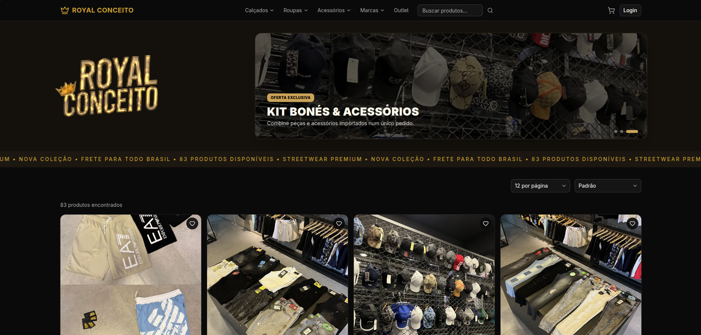

 

> [!NOTE]
> **About this repository:** this is a public showcase. The production source code lives in a private repository, developed for a client. This repo contains a description of the project, its architecture, the main technical decisions and screenshots — no source code.

---

## 📋 About

**Royal Conceito** is a fashion store with two physical locations that sold online only through WhatsApp and phone calls. I designed and built its e-commerce platform from scratch, replacing that manual process with a self-service purchase flow: product browsing, cart, live shipping quotes, online payment and order tracking.

| | |
|---|---|
| **Role** | Full-stack developer — sole developer on the project |
| **Timeline** | February – September 2026 |
| **Scope** | Requirements with the client, data modeling, REST API, React storefront, payment and shipping integrations, deployment and production hardening |
| **Commits** | 250+ in the private repository |

---

## 🖼 Screenshots

### Purchase flow

| Home & catalog | Category / brand navigation |
|:---:|:---:|
|  | 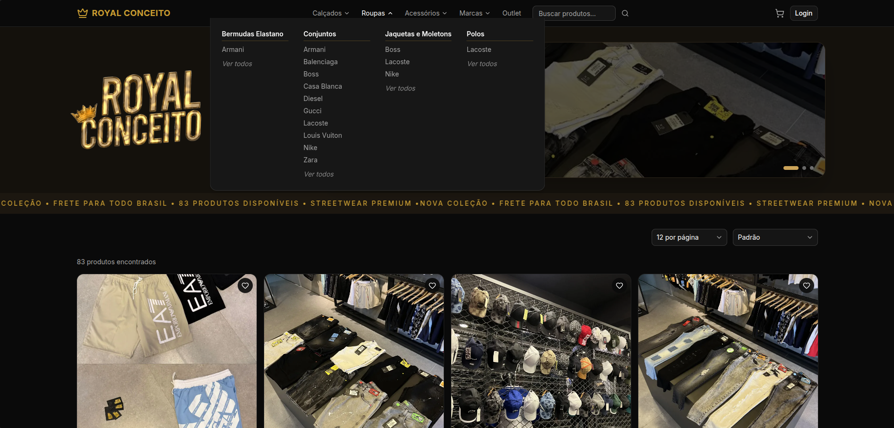 |
| **Product page** | **Cart with shipping estimate** |
| 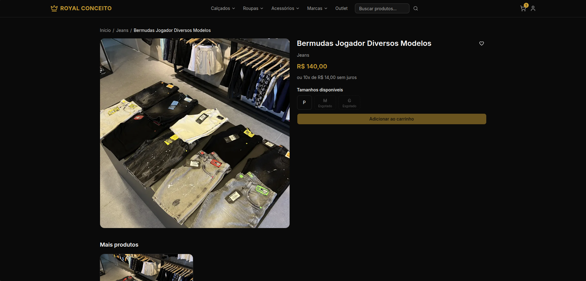 | 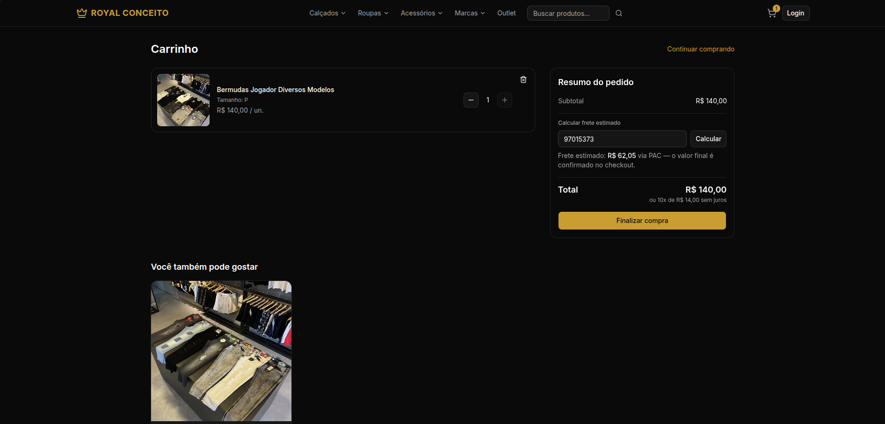 |
| **Checkout with live shipping quote** | **Customer area** |
| 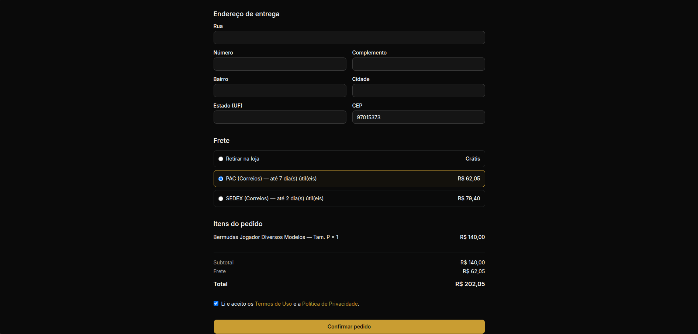 | 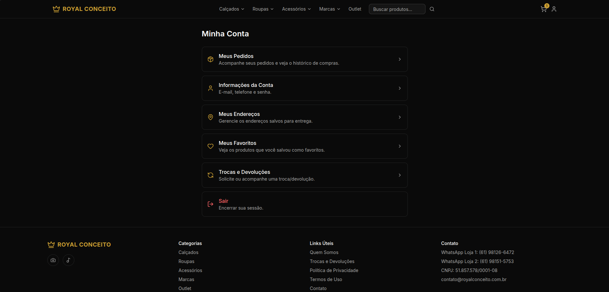 |

### Mobile

| Home | Catalog | Menu | Product |
|:---:|:---:|:---:|:---:|
| 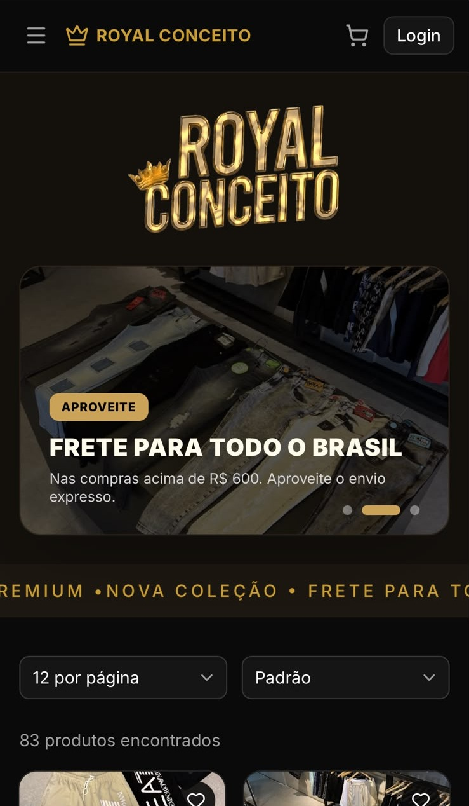 | 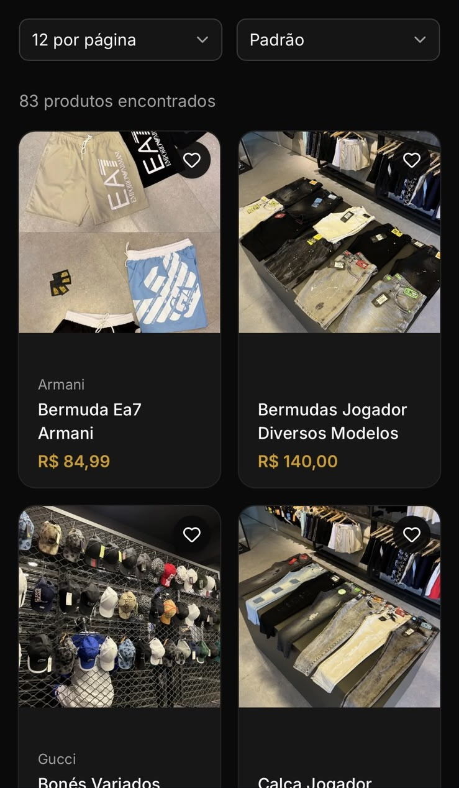 | 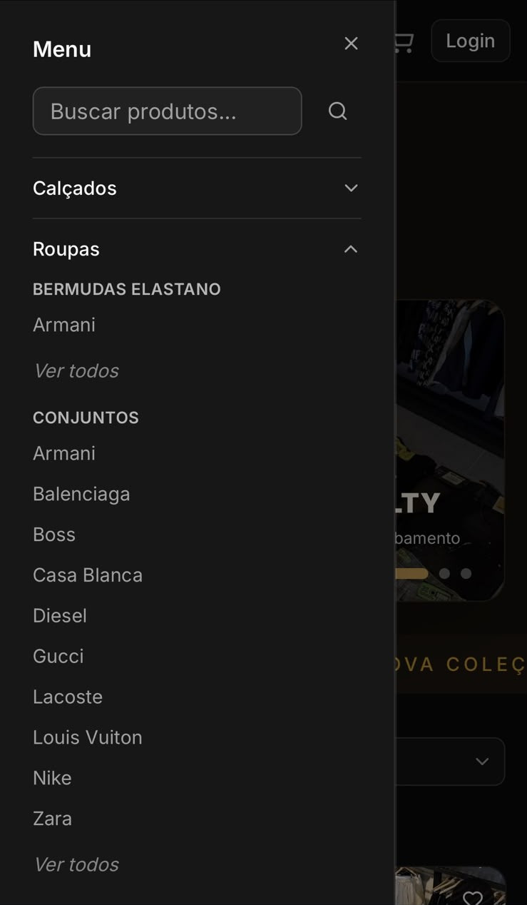 | 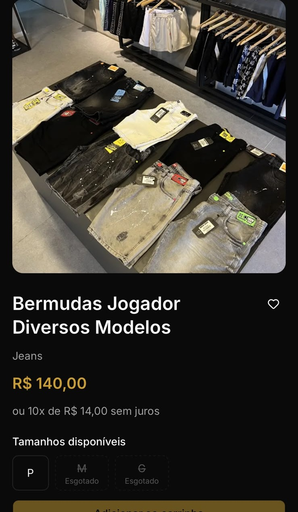 |

### Store admin

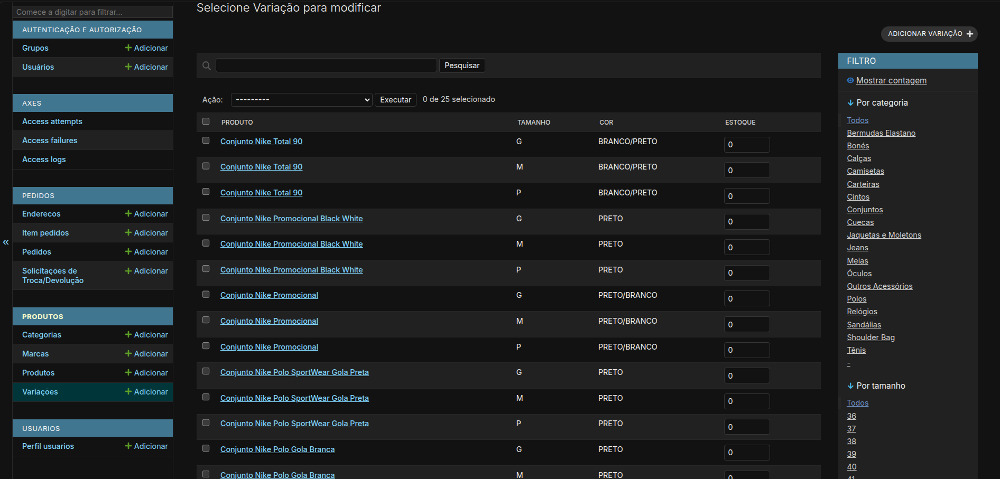

Customized admin panel: product variations by size and color, with stock editable directly in the list.

---

## ✨ Features

### 🛍 Storefront
- Product catalog with categories, brands, search, filters, ordering and pagination
- Header navigation generated from the category → brand structure, with a dedicated mobile menu
- Product variations by **size and color**, each with its own stock; sold-out sizes shown as unavailable
- Shopping cart with shipping estimate, and a checkout with **live shipping quotes** by ZIP code
- **Online payment** (Pix and card) through a payment-link integration
- Store pickup as a shipping option
- Institutional pages (about, contact with store maps, privacy, terms, exchange policy)

### 👤 Customer area
- Order history and order details with status tracking
- Saved addresses, favorites, account data and password change
- Password reset and e-mail verification by e-mail
- Exchange/return requests for delivered orders

### 📦 Orders, stock & payments
- Stock validated and deducted per variation inside atomic transactions — two customers can't buy the same last unit
- Order lifecycle: New → Confirmed → Shipped → Delivered, or Cancelled (with stock returned)
- Orders are confirmed **only by the payment provider's webhook**, never by the browser returning from the payment page
- Duplicate-submission protection on checkout (double clicks and retries never create a second order)
- Price, product and shipping data frozen on the order at purchase time, so later catalog edits never rewrite history
- The store is notified by e-mail when an order is paid

### 🔐 Security
- Authentication with **httpOnly cookies** and CSRF protection, instead of tokens in `localStorage`
- Customers can only see and act on their own data
- Rate limiting on sensitive operations and brute-force protection on the admin panel
- Hardened production configuration — secure by default, refuses to start when misconfigured

### 🧑‍💼 Admin
- Customized admin for catalog, stock and orders, built for a non-technical store owner
- Tuned to avoid N+1 queries, keeping list pages fast as the catalog grows
- Product images uploaded straight to object storage and served through the CDN

See **[docs/decisoes-tecnicas.md](docs/decisoes-tecnicas.md)** for the reasoning behind the main decisions.

---

## 🛠 Tech Stack

### Backend

| Technology | Purpose |
|---|---|
| Python 3.12 · Django 6 | Core language, web framework & ORM |
| Django REST Framework | RESTful API |
| SimpleJWT | Cookie-based JWT authentication |
| django-filter | Filtering, search and ordering |
| PostgreSQL | Production database (SQLite in development) |

### Frontend

| Technology | Purpose |
|---|---|
| React 19 · Vite | UI library & build tool |
| Tailwind CSS 4 · shadcn/ui | Styling & accessible UI primitives |
| React Router | Client-side routing |
| React Hook Form · Zod | Forms & schema validation |
| Axios | HTTP client with transparent session refresh |

### Infrastructure & integrations

| Service | Purpose |
|---|---|
| Render | Backend hosting |
| Cloudflare Pages · CDN | Frontend hosting and edge network |
| Cloudflare R2 | Product image storage on a custom domain |
| Supabase | Managed PostgreSQL |
| InfinitePay | Payments (Pix and card) |
| SuperFrete | Live shipping quotes |
| Resend | Transactional e-mail |

---

## 🏗 Architecture

A React single-page app and a Django REST API, each hosted where it fits best, both behind Cloudflare.

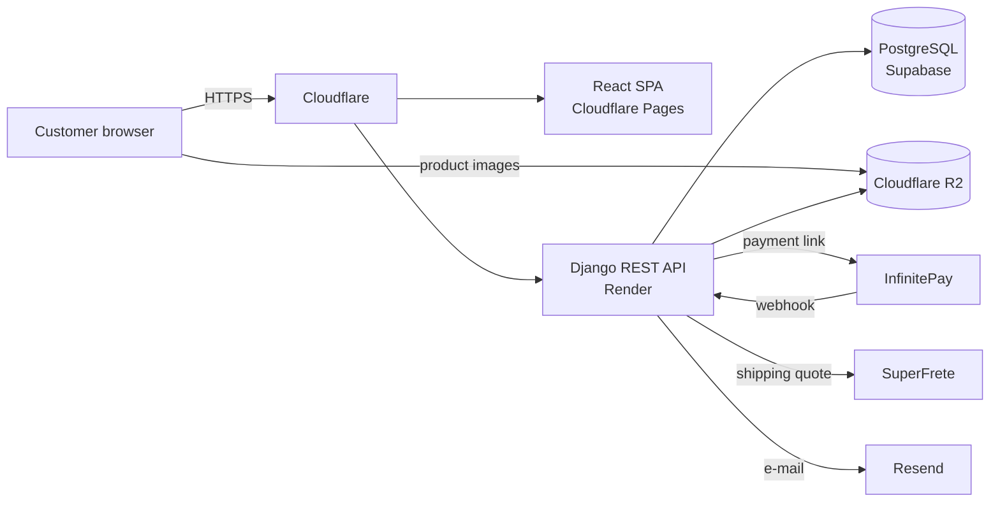

The backend is a **modular monolith** — one Django project split into domain apps (catalog, orders, accounts, core). More detail, including the checkout sequence, in **[docs/arquitetura.md](docs/arquitetura.md)**.

---

## 📌 Status

Deployed to production at **[royalconceito.com.br](https://royalconceito.com.br)**. The complete purchase flow — live shipping quotes, payment link and automatic order confirmation via webhook — was validated end to end with a real payment.

---

## 👤 Developer

| Name | Role | GitHub |
|---|---|---|
| **Renato Ramos Machado** | Full-stack Developer | [@renatorms](https://github.com/renatorms) |

Computer Engineering student — UFSM

<!-- TODO: LinkedIn / e-mail -->

---

© 2026 Renato Ramos Machado. Source code is private and not licensed for reuse. Brand and product images belong to Royal Conceito.

