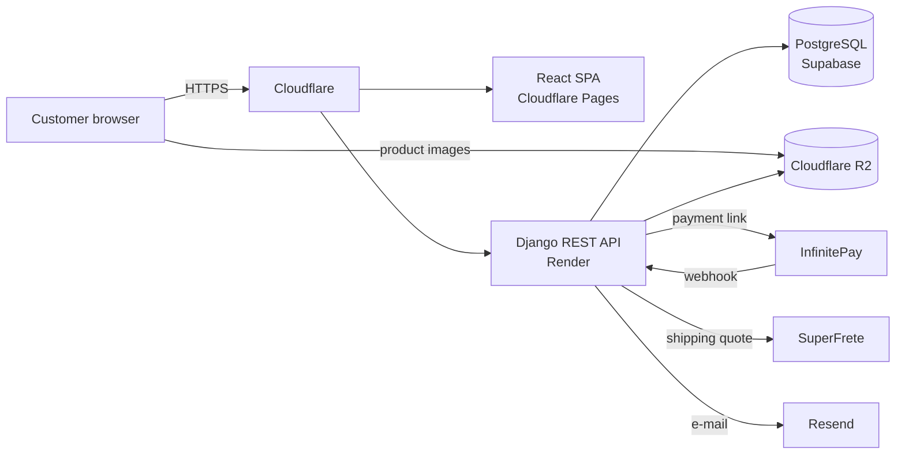
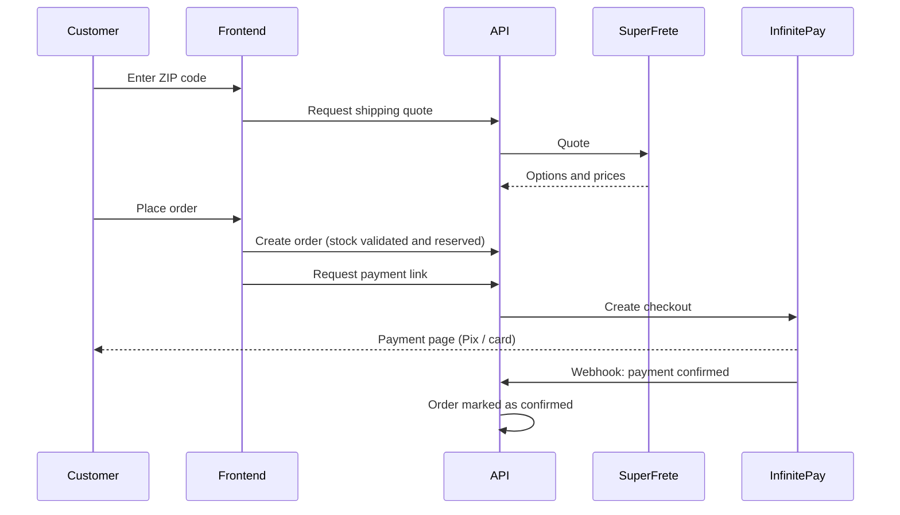

# Architecture

## Overview

A classic split between a React single-page app and a Django REST API, each hosted where it fits best, both behind Cloudflare.

## Backend

A single Django project split into domain apps:

| App | Responsibility |
|---|---|
| Catalog | Categories, brands, products, size variations with per-size stock, favorites |
| Orders | Orders and items, addresses, shipping quotes, payments, exchange/return requests |
| Accounts | Registration, profile, password change and reset, e-mail verification |
| Core | Settings, authentication and shared infrastructure |

Request flow: `Router → ViewSet → Serializer → ORM → business signals → database`.

## Frontend

A React 19 single-page app built with Vite, styled with Tailwind CSS 4 and shadcn/ui components.

- **Routing:** React Router, with public pages (catalog, product, institutional) and a protected customer area.
- **State:** two React contexts instead of a global store — `AuthContext` (session, login/logout, profile) and `CartContext` (cart kept client-side in `localStorage`, capped by per-size stock).
- **Forms:** React Hook Form + Zod, one schema per form, with API validation errors mapped back onto the matching fields.
- **HTTP:** a single Axios instance that sends cookies, attaches the CSRF header on writes and refreshes an expired session transparently.
- **Theme:** a dark visual identity built on CSS variables, so a light theme can be turned on without touching components.

## Checkout flow

## Deployment

- **Frontend:** built by Vite and served as static files from the CDN.
- **Backend:** built and deployed on a managed platform, with static files served by the application itself.
- **Configuration:** all secrets and environment-specific settings come from environment variables; nothing sensitive is versioned.
- **Database:** managed PostgreSQL behind a connection pooler, with persistent connections and health checks on the Django side.
